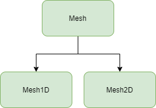

  

# FDM

FDM is a C++ source library that exposes an engine for running the method of Finite Elements across one dimension. This is mostly a personal exploration of The Finite Difference Method, CUDA, and Python Bindings.

## Using

To use the engine, git clone the repository and include the required headers in your source file. Examples are given in the [examples](examples/) directory.

## Building

To build, run `cmake ..` and `cmake --build .` from the `build/` directory.

## Source
The project has a few directories to separate various parts of the project, detailed below

- `build/`: Contains the build output
- `examples`: Examples of how the library can be used
- `src`: The source code for the engine

### Overview

The `Mesh` struct manages information about the object being simulated over. There's an associated _Mesh_ class for each dimension. For example, one dimensional simulations should use `1DMesh`.

The `Engine` class parses information from associated mesh and is responsible for encapsulating the routiens for the Finite Difference Method.

