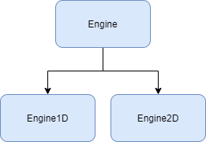

[](https://www.repostatus.org/#active)  []()
[](https://www.codefactor.io/repository/github/thomasthelen/finite-difference-method)


# FDM

FDM is a C++ source library that exposes an engine for running the method of Finite Elements across one dimension. This is mostly a personal exploration of The Finite Difference Method, CUDA, and Python Bindings.

## Using

To use the engine, git clone the repository and include the required headers in your source file. Examples are given in the [examples](examples/) directory.

## Building

To build, run `cmake ..` and `cmake --build .` from the `build/` directory.

## Source
The project has a few directories to separate various parts of the project, detailed below

- `build/`: Contains the build output
- `examples`: Examples of how the library can be used
- `src`: The source code for the engine

### Overview

The `Mesh` struct manages information about the object being simulated over. There's an associated _Mesh_ class for each dimension. For example, one dimensional simulations should use `1DMesh`.


The `Engine` class parses information from associated mesh and is responsible for encapsulating the routines for the Finite Difference Method.



## Creating Simulations


A successful simulation will have both a Mesh and an Engine class instantiated.

The mesh must have the following defined,
```
mesh.spatial_length = 10;
mesh.spatial_step_size = 1;
mesh.thermal_conductivity = 0.01;
mesh.DirchletBoundaryEquation = BC;
mesh.InitialDistribution = InitialRodDistribution;
```

The boundary condition must be a function with the signature

`double BoundaryCondition(double x, int time)`

For example,
```
double BoundaryCondition(double x, int time)
{
	return 15*x+t/2;
}
```

The initial distribution method provides an interface to defining the temperature along the object and must have a signature of

`double TempDistribution(double position)`

For example, a function that defines the temperature as a constant `50` between the boundary points...

```
double TempDistribution(double position) {
	return 10;
}
```

To run, call `StartSimulation` on the engine object and pass it the mesh object.
```
Engine engine;
engine.StartSimulation(int time_length, int time_step, Mesh1D& mesh);
```